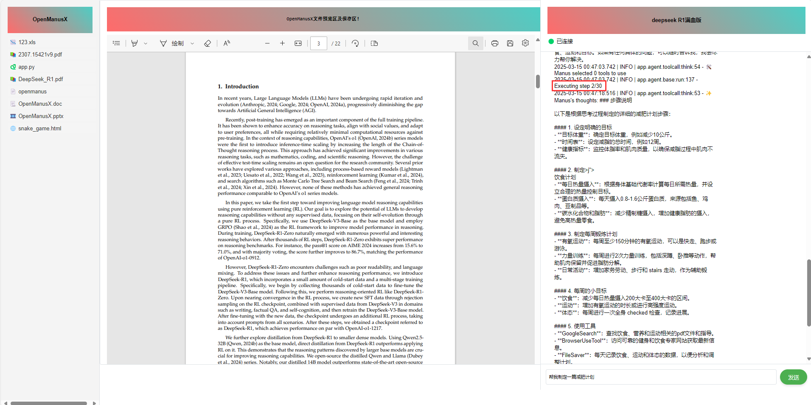
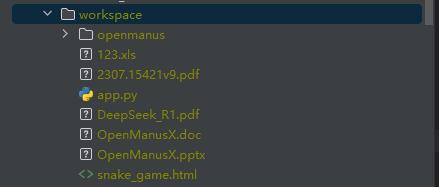
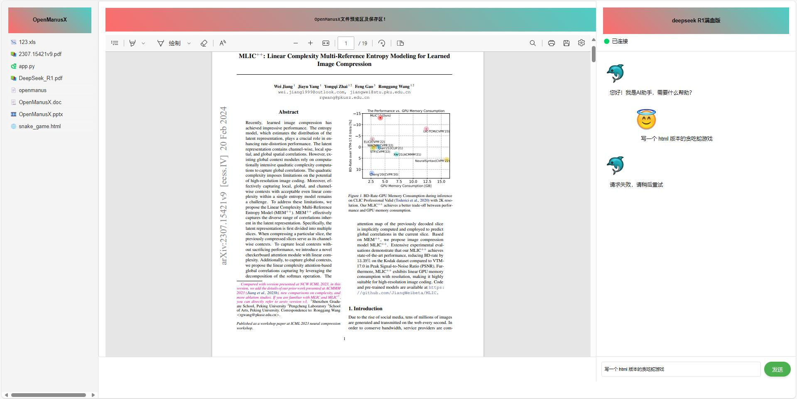
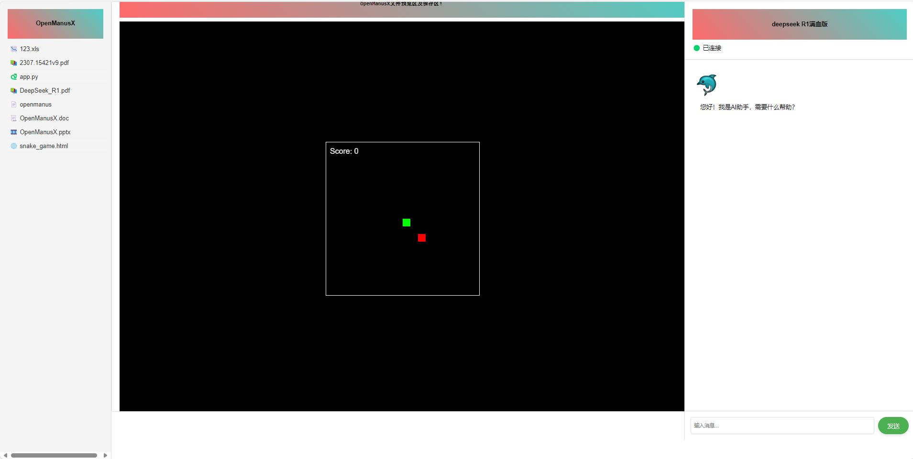
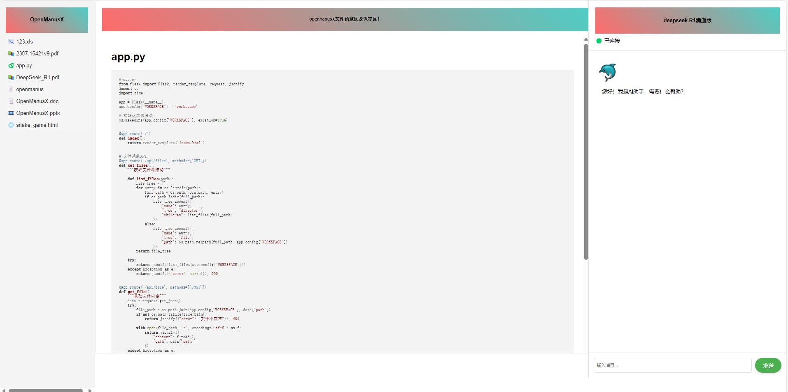
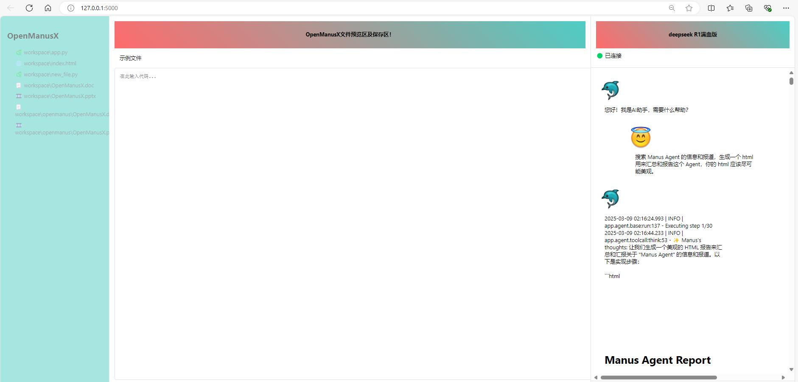
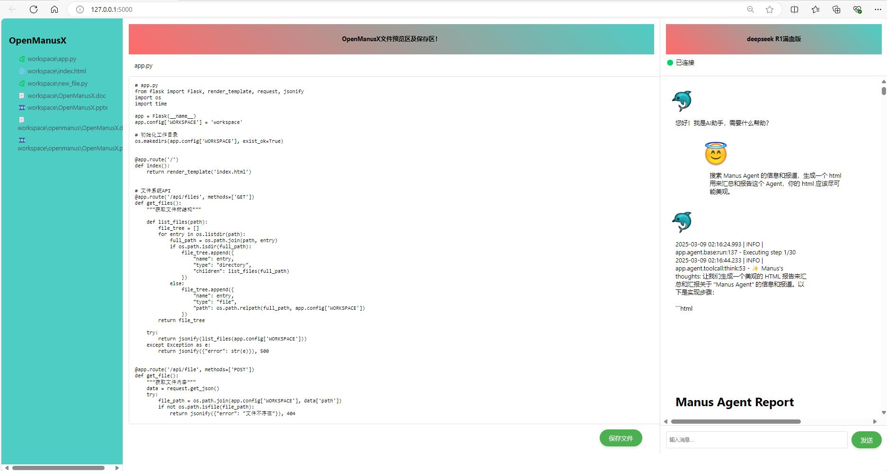

[English](README_en.md) | 简体中文

# OpenManus-WebUI 🙋

&nbsp;&nbsp;&nbsp;&nbsp;Manus和OpenManus 非常棒，非常优秀的工作，目前OpenManus暂无前端，于是本人花了2小时开发基于Flask框架一个简单的WebUI。 项目实质上是通过flask框架构建一个前端页面，进行OpenManus的调用，并对OpenManus生成的文件进行预览。


# News
- 2025-03-14 衷心感谢 **Victor** 的慷慨打赏！修改WebUI流式显示的后端函数，将运行日志的读取方式由日志读取修改为读取队列，减少误触。修改方式参考app/logger.py。[参考链接](https://blog.csdn.net/weixin_43509698/article/details/146269360)
- 2025-03-11 OpenManus-WebUI文件预览区支持HTML、PDF、HTML、CODE的预览。ppt、word、excel目前暂不支持预览，可以下载到本地。可以自行采用OnlyOffice Document Server或者Google Docs Viewer进行的预览。
- 2025-03-08 开源初版WebUI

## 📑 前端页面需要不断的优化，计划
- OpenManus-WebUI
    - [x] 开源初版WebUI
    - [x] OpenManus-WebUI文件预览区及保存区需要支持pdf、ppt、word、excel、代码高亮的预览;    
    - [x] 优化大模型对话框,优化流式输出后端处理逻辑;    
    - [ ] 流式输出的代码进行高亮显示，Markdown的内容进行美化
    - [ ] 不断打磨前后端，完成自动化执行。
## 左侧导航栏显示的默认路径是在workspace目录下，可以手动放置文件，就可以显示。OpenManus生成的文件需要确保文件在OpenManus目录下可以进行预览。
<div align="center">
    
</div>

## WebUI_V2
<div align="center">
    
</div>
<div align="center">
    
</div>
<div align="center">
    
</div>
<div align="center">
    
</div>

## WebUI_V1
<div align="center">
    
</div>
<div align="center">
    
</div>
<div align="center">
    
</div>


## OpenManus-WebUI 使用方式一：（集成到已有OpenManus环境上）：
   1.WebUI_v1和WebUI_v2 目录是采用flask框架部署的前端页面，通过python app.py就可以启动。    
   2.OpenManus安装部署，按照https://github.com/mannaandpoem/OpenManus.git 进行安装OpenManus。  
   3.将WebUI_v2中的static和templates拷贝到OpenManus的项目中，将main.py中函数的调用方式引入到app.py中，即可实现OpenManus的Web调用。   
   4.适配代码,核心代码如下，参考项目中的app.py对OpenManus中的main.py进行修改。    


```bash
    async def main(prompt):
        agent = Manus()
        await agent.run(prompt)
```

##  OpenManus-WebUI 使用方式二：（克隆该工程）：

1. 创建新的 conda 环境：

```bash
conda create -n OpenManus python=3.12
conda activate OpenManus
```

2. 克隆仓库：
```bash
git clone https://github.com/Shybert-AI/OpenManus-WebUI.git
cd OpenManus-WebUI
```
4. 安装依赖：
pip install -r requirements.txt

## 配置说明

OpenManus-WebUI配置API和OpenManus一样，需要配置使用的 LLM API，请按以下步骤设置，本文配置deepseek R1模型：

1. 在 `config` 目录创建 `config.toml` 文件（可从示例复制）：

```bash
cp config/config.example.toml config/config.toml
```

2. 编辑 `config/config.toml` 添加 API 密钥和自定义设置：

```toml
## Global LLM configuration
#[llm]
#model = "deepseek-chat"
#base_url = "https://api.deepseek.com/v1"
#api_key = "sk-xxxxxxxxxxxx"
#max_tokens = 4096
#temperature = 0.6
#
## Optional configuration for specific LLM models
#[llm.vision]
#model = "deepseek-chat"
#base_url = "https://api.deepseek.com/v1"
#api_key = "sk-xxxxxxxxxxxx"


# Global LLM configuration
[llm]
model = "deepseek-ai/DeepSeek-R1-Distill-Qwen-7B"
base_url = "https://api.siliconflow.cn/v1/"
api_key = "sk-xxxxxxxxxxxxxxxxxx"
max_tokens = 4096
temperature = 0.6

# Optional configuration for specific LLM models
[llm.vision]
model = "deepseek-ai/DeepSeek-R1-Distill-Qwen-7B"
base_url = "https://api.siliconflow.cn/v1/"
api_key = "sk-xxxxxxxxxxxxxxxxxx"
```

## 快速启动

一行命令运行OpenManus-WebUI：

```bash
python app.py
```
## 欢迎大佬提出宝贵的建议和意见，提Issues，会不断进行优化和实现。
## 联系与交流

### 联系作者
- **邮箱**：854197093@qq.com
- **QQ群**：1029629549

### 打赏作者
<br/>
<div align="center">
<p>打赏一块钱支持一下作者</p>
<div align="center">
    
</div>
</div>

## 💰 衷心感谢 **Victor** 的慷慨打赏！  ¥ 5 元，您每一分钱都不会被辜负。💰
## 💰 衷心感谢 **kelly** 的慷慨打赏！  ¥ 1 元，您每一分钱都不会被辜负。💰


### ✨ 您的投资将用于：

<div align="center">

|       项目      |  占比  |           说明          |
|:---------------:|:------:|:-----------------------:|
| **代码优化**     | 40%    | <div align="center">提升项目性能和稳定性</div> |
| **文档完善**     | 30%    | <div align="center">制作更友好的使用指南</div> |
| **功能扩展**     | 30%    | <div align="center">开发用户建议的新特性</div> |

</div>


## 致谢

特别感谢 [OpenManus](https://github.com/mannaandpoem/OpenManus)
和 [browser-use](https://github.com/browser-use/browser-use) 为本项目提供的基础支持！

## ⭐ Star History

[](https://star-history.com/#Shybert-AI/OpenManus-WebUI&Date)
